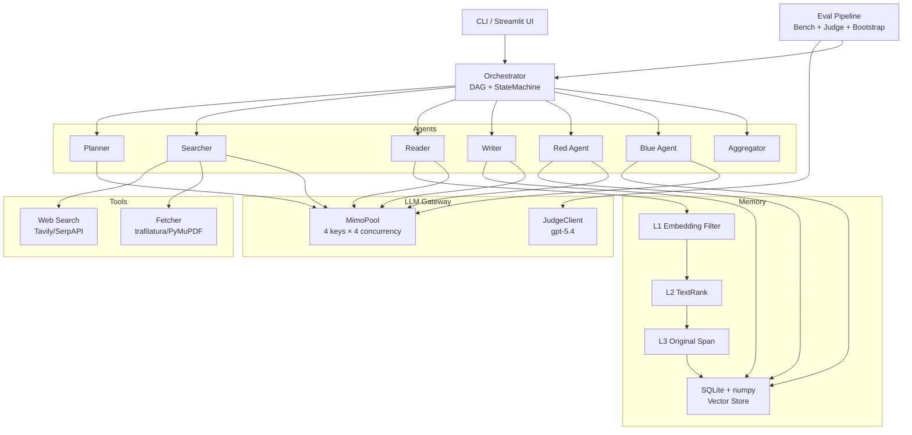
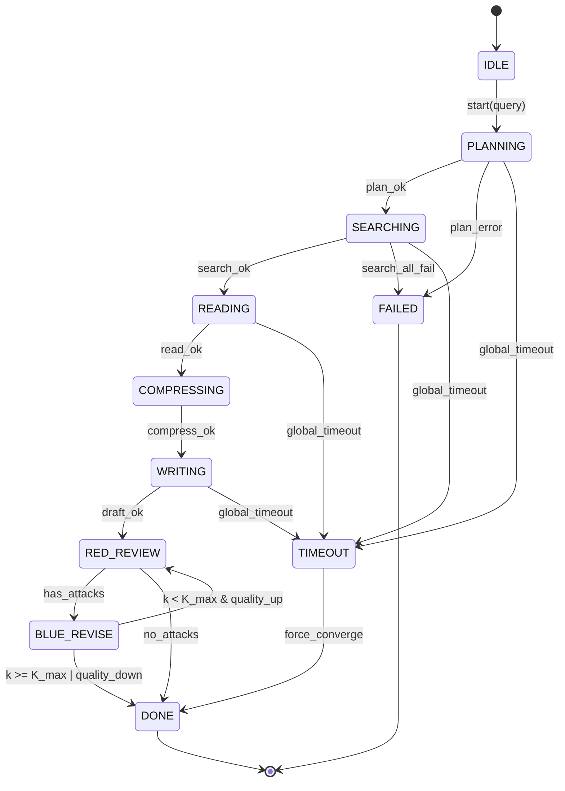
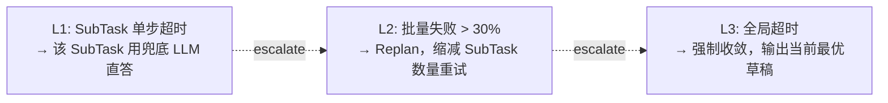

# Design Document

## Overview

DeepResearch-MultiAgent 采用分层架构：CLI/UI 入口 → Orchestrator（DAG + 状态机）→ Agents（业务节点）→ Tools / Memory / LLM 网关。系统全程异步，所有 LLM 调用走两条独立通道：MimoPool（被测主链路，4 key × 4 并发）和 JudgeClient（评测专用，独立限流）。

设计核心权衡：

- **不用 LangGraph**：自研 DAG 调度器，控制力更强且面试可深讲
- **不用外部向量库**：SQLite + numpy 暴力 cosine，万级以下规模反而更简单更快
- **Judge 强制走独立模型族**：避免 self-preference bias，是评测体系的合法性基础
- **状态机与 DAG 分层**：DAG 描述节点依赖与并发，状态机描述单个研究任务的生命周期，二者互不耦合

## Steering Documents Alignment

工作区目前无 `.kiro/steering/*.md` 文件，本设计无需对齐已有 steering。后续若需添加项目级编码规范（如 async 风格、错误处理约定），可在 `.kiro/steering/` 下新增。

## Architecture

### High-Level Architecture



### State Machine



### Degradation Strategy



## Project Structure

```
deepresearch-multiagent/
├── pyproject.toml
├── README.md
├── .env (用户已提供)
├── .kiro/specs/deepresearch-multiagent/
│   ├── requirements.md
│   ├── design.md
│   └── tasks.md
├── src/dr_agent/
│   ├── __init__.py
│   ├── cli.py                       # Typer CLI 入口
│   ├── config.py                    # 全局配置 + .env 加载
│   ├── llm/
│   │   ├── __init__.py
│   │   ├── pool.py                  # MimoPool（4 key 负载均衡）
│   │   ├── judge.py                 # JudgeClient（gpt-5.4 独立通道）
│   │   ├── token_bucket.py          # 滑窗令牌桶
│   │   └── retry.py                 # 重试 + 指数退避
│   ├── schemas/
│   │   ├── __init__.py
│   │   ├── task.py                  # ResearchTask, SubTask, AgentState
│   │   ├── attack.py                # Red Attack JSON Schema
│   │   ├── patch.py                 # Blue Patch JSON Schema
│   │   └── report.py                # ResearchReport, Citation
│   ├── orchestrator/
│   │   ├── __init__.py
│   │   ├── dag.py                   # DAG 调度器
│   │   ├── state_machine.py         # 9 状态状态机
│   │   ├── envelope.py              # ResultEnvelope（异常隔离）
│   │   └── degrade.py               # L1/L2/L3 降级策略
│   ├── agents/
│   │   ├── __init__.py
│   │   ├── base.py                  # AbstractAgent
│   │   ├── planner.py
│   │   ├── searcher.py
│   │   ├── reader.py
│   │   ├── writer.py
│   │   ├── red.py
│   │   ├── blue.py
│   │   └── aggregator.py
│   ├── memory/
│   │   ├── __init__.py
│   │   ├── compress.py              # L1/L2/L3 三级压缩
│   │   ├── store.py                 # SQLite + numpy 向量存储
│   │   ├── dedupe.py                # 预写去重
│   │   └── contradict.py            # 矛盾检测
│   ├── tools/
│   │   ├── __init__.py
│   │   ├── search.py                # Tavily / SerpAPI 封装
│   │   └── fetcher.py               # trafilatura + PyMuPDF
│   ├── eval/
│   │   ├── __init__.py
│   │   ├── bench.py                 # ResearchBench 加载
│   │   ├── rule_metrics.py          # 事实准确率 / 幻觉率 / 引用覆盖率
│   │   ├── judge_metrics.py         # LLM-as-Judge 5 维度
│   │   ├── stats.py                 # Bootstrap CI + Cohen's d
│   │   └── runner.py                # 评测主流程
│   └── utils/
│       ├── __init__.py
│       ├── logging.py               # loguru 配置
│       └── trace.py                 # 每个任务一个 trace_id
├── benchmarks/researchbench/
│   ├── README.md
│   └── questions.jsonl              # 11 领域 × 35 题
├── experiments/
│   └── results/                     # 评测产出
├── reports/                         # 跑出来的样例报告
├── tests/
│   ├── test_pool.py
│   ├── test_state_machine.py
│   ├── test_compress.py
│   ├── test_dedupe.py
│   └── test_stats.py
└── docs/
    ├── architecture.md
    └── ablation-template.md
```

## Components and Interfaces

### Component 1: MimoPool（LLM 网关）

- **Purpose**：在 4 个 mimo key 上做最少在飞负载均衡 + 每 key 滑窗令牌桶限流，对外提供统一的 `chat(messages, **opts)` 异步接口
- **Interface**：
  ```python
  class MimoPool:
      def __init__(self, keys: list[str], base_url: str, model: str,
                   per_key_concurrency: int = 4, per_key_rpm: int = 100): ...
      async def chat(self, messages: list[dict], *, json_mode: bool = False,
                     temperature: float = 0.7, max_tokens: int | None = None,
                     trace_id: str | None = None) -> ChatResult: ...
      def stats(self) -> dict: ...  # 每 key 指标
  ```
- **Dependencies**：httpx (async)、自写 token_bucket、loguru
- **Reuses**：utils.logging、schemas（ChatResult dataclass）

### Component 2: JudgeClient

- **Purpose**：独立调用 aveve.xyz 的 gpt-5.4，仅用于评测打分。不参与主链路并发，避免与被测流量竞争
- **Interface**：
  ```python
  class JudgeClient:
      def __init__(self, api_key: str, base_url: str, model: str,
                   concurrency: int = 4): ...
      async def score(self, *, question: str, report: str,
                      rubric: JudgeRubric, n_samples: int = 3) -> JudgeScore: ...
  ```
- **Dependencies**：httpx
- **Reuses**：retry.py 共享重试逻辑

### Component 3: Orchestrator（DAG + StateMachine）

- **Purpose**：根据 ResearchTask 构造 DAG，按拓扑顺序异步执行各 Agent 节点；同时托管单任务状态机的转移与日志
- **Interface**：
  ```python
  class Orchestrator:
      def __init__(self, agents: AgentRegistry, pool: MimoPool,
                   memory: MemoryStore, config: OrchConfig): ...
      async def run(self, query: str, *, trace_id: str | None = None) -> ResearchReport: ...
      def export_state_graph(self, fmt: str = "mermaid") -> str: ...
  ```
- **Dependencies**：asyncio、所有 Agent、MemoryStore、MimoPool
- **Reuses**：envelope.ResultEnvelope（异常隔离）、degrade（降级策略）

### Component 4: AbstractAgent

- **Purpose**：所有 Agent 的统一基类，规范输入 / 输出契约和 trace 传播
- **Interface**：
  ```python
  class AbstractAgent(Generic[InT, OutT]):
      name: str
      async def run(self, inp: InT, ctx: AgentContext) -> ResultEnvelope[OutT]: ...
  ```
- **Dependencies**：MimoPool（通过 ctx 注入）、MemoryStore
- **Reuses**：envelope.ResultEnvelope

### Component 5: MemoryStore（SQLite + numpy 向量）

- **Purpose**：跨 Agent 共享记忆，向量索引 + 预写去重 + 矛盾检测
- **Interface**：
  ```python
  class MemoryStore:
      def __init__(self, db_path: Path, embedder: Embedder): ...
      async def write(self, item: MemoryItem) -> WriteResult: ...
      async def search(self, query: str, top_k: int = 5,
                       agent_filter: str | None = None) -> list[MemoryItem]: ...
      async def detect_contradictions(self, item: MemoryItem) -> list[Contradiction]: ...
  ```
- **Dependencies**：sqlite3 (内置)、numpy、Embedder（mimo embedding 或 bge-m3）
- **Reuses**：compress.py（写入前自动 L1/L2/L3 压缩）

### Component 6: Compressor（三级压缩）

- **Purpose**：对 Reader 输入的网页文本执行 L1 Embedding 过滤 → L2 TextRank → L3 原文保留
- **Interface**：
  ```python
  @dataclass
  class CompressResult:
      kept_chunks: list[Chunk]
      stats: CompressStats  # 各级压缩比

  class Compressor:
      async def compress(self, query: str, chunks: list[Chunk],
                         token_budget: int = 4000) -> CompressResult: ...
  ```

### Component 7: Red / Blue Agent

- **Red**：输出 `Attack[]`，每条结构化（type / span / evidence / severity）
- **Blue**：输入 `Attack[]`，输出 `Patch[]`（action ∈ ADD/DELETE/MODIFY/VERIFY，target_span，new_text）
- **JSON 解析三层 fallback**：
  1. 原 prompt 直接 JSON 解析
  2. JSON 修复模式（`json_mode=True` 显式声明）+ 重试
  3. 启发式正则提取（匹配 `{...}` 大括号块）

### Component 8: Eval Runner

- **Purpose**：加载 ResearchBench / HotpotQA，对每条样本跑被测系统 → 跑规则指标 + Judge → Bootstrap 统计
- **Interface**：
  ```python
  class EvalRunner:
      async def run(self, bench: Bench, system: Orchestrator,
                    judge: JudgeClient, *, n_judge_samples: int = 3,
                    bootstrap_iters: int = 1000) -> EvalReport: ...
  ```

## Data Models

### ResearchTask & SubTask

```python
class SubTask(BaseModel):
    id: str
    query: str           # 拆分后的子问题
    parent_id: str
    expected_outputs: list[str]   # 预期产出（事实 / 数据 / 引用）

class ResearchTask(BaseModel):
    id: str
    user_query: str
    subtasks: list[SubTask]
    state: AgentState     # IDLE / PLANNING / ... / DONE
    created_at: datetime
    trace_id: str
```

### Attack（Red 输出）

```python
class AttackType(str, Enum):
    FACTUAL = "factual"
    LOGIC = "logic"
    CITATION = "citation"

class Attack(BaseModel):
    id: str
    type: AttackType
    span: str            # 被攻击的原文片段
    evidence: str        # 攻击依据
    severity: float = Field(ge=0.0, le=1.0)
    suggested_action: PatchAction | None = None
```

### Patch（Blue 输出）

```python
class PatchAction(str, Enum):
    ADD = "ADD"
    DELETE = "DELETE"
    MODIFY = "MODIFY"
    VERIFY = "VERIFY"

class Patch(BaseModel):
    attack_id: str
    action: PatchAction
    target_span: str
    new_text: str | None = None   # ADD / MODIFY 必填
    verification_evidence: str | None = None  # VERIFY 必填
    accepted: bool = False        # 由 Orchestrator 决定是否采纳
```

### MemoryItem

```python
class MemoryItem(BaseModel):
    id: str
    task_id: str
    agent_id: str
    text: str
    embedding: list[float] | None = None   # 写入时填充
    created_at: datetime
    is_duplicate: bool = False
    contradicts_with: list[str] = Field(default_factory=list)
```

### EvalReport

```python
class JudgeScore(BaseModel):
    accuracy: float
    completeness: float
    logic: float
    citation_quality: float
    readability: float
    raw_samples: list[dict]   # n 次 Judge 原始返回

class SampleResult(BaseModel):
    question_id: str
    domain: str
    rule_metrics: dict        # factual_acc / hallucination / citation_cov
    judge_score: JudgeScore
    report_path: Path

class EvalReport(BaseModel):
    samples: list[SampleResult]
    aggregate_by_domain: dict[str, dict]
    bootstrap_ci_95: dict     # {metric: (low, high)}
    cohens_d_vs_baseline: dict | None
```

## Error Handling

### Error Scenarios

1. **MimoPool 全部 key 触发限流**
   - **Handling**：等待最近触发限流的 key 退避结束（指数退避，max 60s）后重试；如所有 key 均退避中，主调用以 `LLMUnavailable` 异常返回
   - **User Impact**：CLI 输出 "all keys throttled, retrying in <s>s"，最终若仍失败则降级该 SubTask 至兜底直答（L1 降级）

2. **Red Agent 返回非法 JSON**
   - **Handling**：三层 fallback（原样重试 → strict JSON 模式 → 正则提取），三层均失败标记 attacks=[]
   - **User Impact**：本轮跳过 Red-Blue，直接进入 DONE；日志中记录 `red_json_parse_failed=true`

3. **Searcher 工具（Tavily/SerpAPI）全部失败**
   - **Handling**：切换备用搜索源；如全部失败，该 SubTask 进入 L1 降级，由兜底 LLM 基于自身知识直答并标注 `unverified=true`
   - **User Impact**：报告中该段会附带 "未能联网验证" 警示标记

4. **MemoryStore 写入冲突或 SQLite 死锁**
   - **Handling**：单写入锁（sqlite WAL 模式 + asyncio.Lock）；冲突时排队
   - **User Impact**：极端情况下写入延迟增加；不会丢数据

5. **Judge 调用超时或限流**
   - **Handling**：JudgeClient 独立重试 3 次，间隔指数退避；最终失败该样本 Judge 分计为 NaN，统计聚合时 skip
   - **User Impact**：评测报告中该样本只有规则指标无 Judge 分

6. **全局 pipeline 超时**
   - **Handling**：触发 L3 强制收敛，将当前已完成的 SubTask 草稿汇总输出
   - **User Impact**：报告完整性降低，但不空跑；标记 `degraded=true`

## Testing Strategy

### Unit Testing

- `pool.py`：mock httpx，验证 least-in-flight 选 key 顺序、令牌桶滑窗、429 退避、key 失败切换
- `state_machine.py`：表驱动测试所有合法转移与所有非法转移（应抛 InvalidTransition）
- `compress.py`：构造已知 chunk，验证 L1 阈值过滤、L2 top-k 选取、L3 命名实体保留
- `dedupe.py`：相同 / 近似 / 不同三组样本，验证去重边界
- `stats.py`：对比 scipy 标准实现，验证 Bootstrap CI 与 Cohen's d 数值

### Integration Testing

- 端到端最小流程：mock LLM 返回固定 JSON，跑 Planner → Searcher → Reader → Writer → Red → Blue 全链路，断言最终 ResearchReport 结构
- MimoPool 真实并发压力测试：`pytest-asyncio` 启动 32 个并发 chat 请求，验证全局并发不超过 16，无 key 触发限流（在 mock httpx server 下）

### End-to-End Testing

- 启动真实 mimo 后端，跑一条 ResearchBench 题目，验证 5 分钟内输出符合 schema 的报告且 Judge 分 ≥ 3.0/5
- 评测流水线 smoke：对 3 题子集跑完整 eval，验证 CSV / Markdown 报告生成

## Performance Considerations

- 全局 LLM 并发硬上限 16（4 key × 4），单 query 总调用约 30-80 次，wall-clock 预计 3-8 分钟
- SQLite 向量检索：万级以下记录 numpy 暴力 cosine < 100ms，无需引入向量库
- Embedding 调用是高频热点，需做 LRU 缓存（基于文本哈希），命中率预期 > 30%（去重 + 多 Agent 共查同一 chunk）
- TextRank 在长文本上 O(n²)，对超长 chunk 先做 1000 字滑窗后再 TextRank，避免阻塞事件循环（必要时 `asyncio.to_thread`）

## Security Considerations

- `.env` 不入仓库（README 中 `.gitignore` 模板包含 `.env`）
- 所有 LLM 调用日志中对 API key 做 mask（保留前 6 后 4），日志中只记 trace_id 和 token 用量
- Tool 层 fetcher 对 URL 做 SSRF 防护（白名单 scheme=https，拒绝 localhost / 内网 CIDR）
- LLM 输出在写入 SQLite 前做长度上限校验（默认单条 ≤ 8 KB），防止异常返回打爆数据库

## Implementation Notes

### Phase 1（最小可运行骨架，第 1 周）

只实现：MimoPool（含负载均衡，不含完整指标）+ JudgeClient + 一个最简单的"Planner → Writer"两节点 DAG + CLI `dr-agent run`。目标是跑通端到端 hello world，输出一份不含检索的"基于知识的报告"。

### Phase 2（第 2-3 周）

补全 Searcher / Reader / Compressor / MemoryStore，状态机完整化，支持降级 L1。

### Phase 3（第 4 周）

加入 Red / Blue 与 K 轮对抗循环，实现 JSON 三层 fallback。

### Phase 4（第 5 周）

构建 ResearchBench、规则指标、LLM-as-Judge、Bootstrap 统计。

### Phase 5（第 6 周）

消融实验、Streamlit demo、技术博客、README polish。
