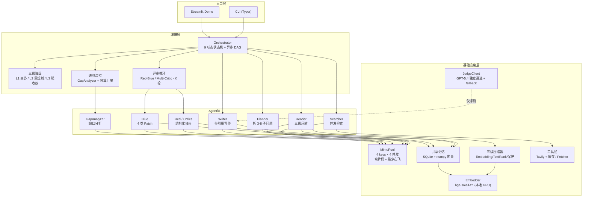
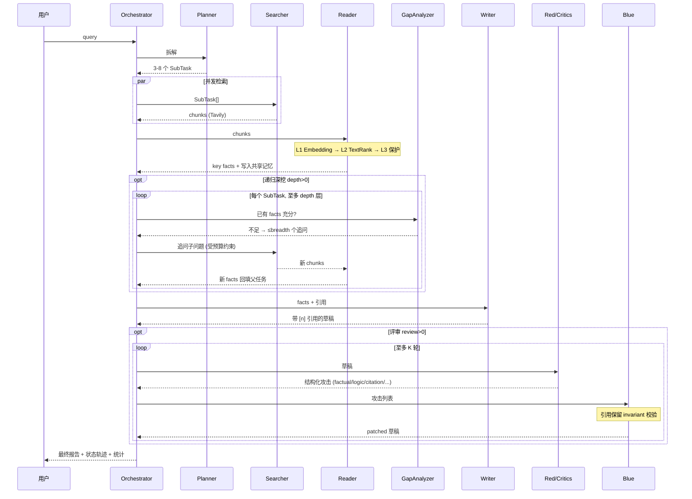
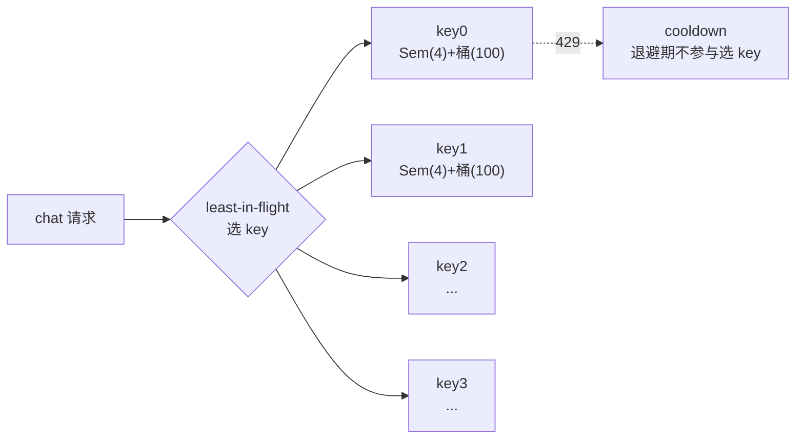
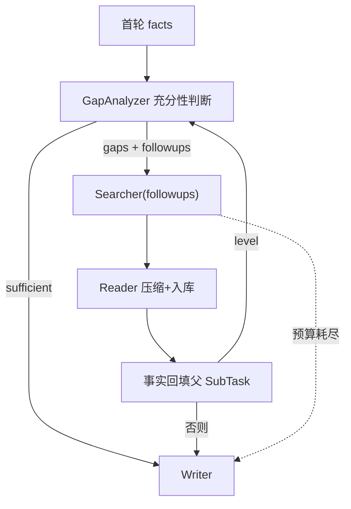

# DeepResearch-MultiAgent

面向复杂深度研究任务的多智能体协作系统。给定一个研究问题，系统通过 **规划 → 检索 → 阅读压缩 → 递归深挖 → 写作 → 对抗评审** 的全链路 Agent 协作，输出一份带引用、结构化、并经过自动化评测的研究报告。

> **设计立场：** 弱基座（mimo-v2.5-pro）+ 强工程。不靠堆模型，靠 Agent 编排把质量做上去。
> **评测器：** GPT-5.4（独立模型族，避免 self-preference bias），不可用时降级到 mimo 并标注 self-bias risk。
> **完整规格：** [`docs/spec/`](./docs/spec) ｜ **技术报告（单文件 HTML）：** [`docs/report.html`](./docs/report.html)

---

## 目录

- [整体架构](#整体架构)
- [端到端数据流](#端到端数据流)
- [分层详解](#分层详解)
- [核心机制](#核心机制)
- [实验结果](#实验结果)
- [快速开始](#快速开始)
- [项目结构](#项目结构)
- [文档](#文档)

---

## 整体架构

四层分层：**入口层 → 编排层 → Agent 层 → 基础设施层**。全程异步；所有 LLM 调用走两条**完全独立**的通道——`MimoPool`（被测主链路）与 `JudgeClient`（评测专用），物理隔离以保证评测合法性。



**为什么是两条独立 LLM 通道**：被测主链路（mimo）和评测器（GPT-5.4）从 model family 到 base_url 完全分离。让弱模型评测自己有系统性的 self-preference bias（Zheng et al. 2023；Panickssery et al. 2024），物理隔离是评测结论可信的前提。

---

## 端到端数据流

一次完整研究任务（含递归深挖 + K=2 评审）的时序：



典型状态轨迹：`IDLE → PLANNING → SEARCHING → READING → COMPRESSING → WRITING → RED_REVIEW → BLUE_REVISE → RED_REVIEW → BLUE_REVISE → DONE`

---

## 分层详解

### 入口层
| 组件 | 说明 |
|---|---|
| CLI (`cli.py`) | `dr-agent run / eval / state-graph / pool-stats / smoke-judge`，基于 Typer |
| Streamlit (`ui/app.py`) | Live Run（实时跑 + 看状态机/评审轮次）+ Eval Browser（离线浏览消融结果） |

### 编排层（`orchestrator/`）
| 组件 | 职责 |
|---|---|
| `runner.py` | 端到端唯一公开入口；串联 Planner→Searcher→Reader→[深挖]→Writer→[评审] |
| `state_machine.py` | 表驱动 9 状态 + 2 异常态；非法迁移抛错；可导出 mermaid |
| `envelope.py` | `ResultEnvelope[T]` 异常隔离容器，一个并发分支抛错不炸其他分支 |
| `red_blue_loop.py` | K 轮评审循环，支持 red / multi 两种 reviewer + 质量回滚 |
| `deepdive.py` | 递归深挖驱动 + 全局搜索预算硬上限 |

### Agent 层（`agents/`）
所有 Agent 继承 `AbstractAgent[InT, OutT]`，统一返回 `ResultEnvelope`，trace_id 自动传播。

| Agent | 输入 → 输出 | 职责 |
|---|---|---|
| Planner | query → SubTask[] | 拆 3-8 个互补子问题（JSON Schema 校验 + 失败回退） |
| Searcher | SubTask[] → Chunk[] | 并发调 Tavily，正文不足回退 Fetcher 抓取 |
| Reader | Chunk[] → KeyFacts | 三级压缩 + 写入共享记忆（含去重） |
| Writer | KeyFacts → Report | 章节并行写作，强制基于事实并标 `[n]` 引用 |
| Red / Critics | Report → Attack[] | 结构化攻击 + 三层 JSON fallback |
| Blue | Attack[] → Patch[] | 4 类 patch，应用前过引用保留 invariant |
| GapAnalyzer | facts → followups | 判断事实充分性，产出更深追问 |

### 基础设施层
| 组件 | 关键设计 |
|---|---|
| `llm/pool.py` | 4 key 各自 Semaphore(4) + 滑窗令牌桶(100 RPM)；least-in-flight 选 key；切 key 重试 |
| `llm/judge.py` | 独立 GPT-5.4 通道；端点挂掉自动降级 mimo + 标注 self-bias |
| `memory/store.py` | SQLite + numpy 暴力 cosine；预写去重；矛盾检测 |
| `memory/compress.py` | L1 Embedding 过滤 → L2 TextRank → L3 命名实体/数字/引用保留 |
| `memory/embedder.py` | bge-small-zh-v1.5（本地 95MB / 512-D / GPU <5ms）+ LRU 缓存 |
| `tools/search.py` | Tavily + SQLite 缓存（省配额） |
| `tools/fetcher.py` | trafilatura（网页）+ PyMuPDF（PDF）+ SSRF 防护 |

---

## 核心机制

### MimoPool — 4 key 负载均衡
每个 key 持有独立的并发槽 + 滑窗令牌桶，按 `(in_flight, recent_rpm)` 最少在飞选 key，429 退避 + 切 key 重试。



### 递归深挖 — 单层 RAG → deep research


### Red-Blue 对抗 vs Multi-Critic
- **Red-Blue**：单 Red 兼顾 4 维度攻击 → Blue 修复，K 轮循环
- **Multi-Critic**：3 个 persona critic（事实核查/逻辑审稿/引用审计）并行 → 双信号共识聚合（span 去重 + section 热点加权）→ Blue 修复
- **引用保留 invariant**（关键）：Blue 的 MODIFY 若丢失 `[n]` 引用、DELETE 若孤立引用，patch 被代码层拒绝——prompt 是概率约束，invariant 是确定性兜底

### 三级语义压缩
| 阶段 | 粒度 | 方法 | 保留依据 |
|---|---|---|---|
| L1 | chunk | bge-small-zh cosine | ≥ 0.45 |
| L2 | 句子 | jieba 分词 + TextRank 图中心度 | 每 chunk top-8 |
| L3 | 句子 | 正则识别数字/年份/引号/缩写 | 强制保留低频高价值句 |

---

## 工程亮点

- **递归深挖（Recursive Deep-Dive）**：GapAnalyzer 分析每个 SubTask 的事实充分性，不足则生成追问子问题，按 depth/breadth 递归检索+阅读，全局搜索预算硬上限保护配额。把单层 RAG 升级为真正的 deep research（对标 GPT-Researcher 的 breadth/depth）。
- **MimoPool**：自研 4-key 负载均衡 + 每 key 滑窗令牌桶（100 RPM）+ 信号量并发控制（4/key），最少在飞调度，全局 16 并发
- **9 状态状态机**：表驱动转移，所有合法/非法迁移可静态枚举，可导出 mermaid 图
- **三级降级策略**：单 SubTask 超时 → L1 兜底 LLM 直答 / 批量失败 > 30% → L2 重规划 / 全局超时 → L3 强制收敛
- **Red-Blue 对抗降噪**：4 维度结构化 JSON 攻击（factual / logic / citation / completeness）+ 4 类 Patch 动作（ADD / DELETE / MODIFY / VERIFY）+ K 轮循环 + 引用保留 invariant
- **Multi-Critic 多角色评审**（Red 的进阶替代）：3 个 persona critic（事实核查 / 逻辑审稿 / 引用审计）并行攻击 + 双信号共识聚合（span 去重 + section 热点加权），主张精度优先；通过 `--reviewer multi` 启用
- **三层 JSON 解析 fallback**：直接 → strict-mode 重试 → 正则提取，对抗 LLM 输出格式抖动
- **三级语义压缩**：L1 Embedding 余弦过滤（bge-small-zh）→ L2 TextRank 句子级抽取 → L3 命名实体 / 数字 / 引用原句保留
- **跨 Agent 共享记忆**：SQLite + numpy 暴力 cosine（万级以下检索 < 100ms）+ 预写去重（cos > 0.92）+ 启发式矛盾检测
- **完整评测体系**：自建 ResearchBench（11 领域 × 35 题）+ 规则指标（事实准确率 / 幻觉率 / 引用覆盖率）+ LLM-as-Judge 5 维度 × n_samples 自一致性 + Bootstrap (BCa) 95% CI + Cohen's d
- **Judge 降级保护**：独立 Judge 端点不可用时自动降级到 mimo，并标注 `self_bias_risk=True`，保证评测合法性可追溯

## 实验结果（ResearchBench, n=35, paired bootstrap BCa）

| 配置 | factual_acc | hallu_rate | cite_cov | judge_overall |
|---|---|---|---|---|
| baseline (single-prompt) | 0.960 | 0.146 | 0.000 | 4.240 |
| pipeline-r0 (full DAG) | 1.000 | 0.164 | 0.393 | 4.299 |
| **pipeline-r2 (full DAG + Red-Blue K=2)** | **1.000** | **0.158** | **0.472** | **4.329** |

**关键效应**：

| 对比 | 指标 | Δ | Cohen's d |
|---|---|---|---|
| r0 vs baseline | citation_coverage | +0.393 | **+8.65 (巨大)** |
| r0 vs baseline | factual_accuracy | +0.040 | +0.60 (中等) |
| r2 vs r0 | citation_coverage | +0.079 | **+1.31 (巨大)** |
| r2 vs r0 | factual_accuracy | +0.000 | preserved |

详细消融与 Red-Blue 对抗效果分析见 [`docs/ablation.md`](./docs/ablation.md)。

## 快速开始

```bash
# 1. 装依赖
pip install -e .
pip install sentence-transformers tavily-python trafilatura pymupdf scikit-learn jieba sumy

# 2. 准备 .env（参考 .env.example）
#    - 4 个 mimo key （OPENAI_API_KEY1..4）
#    - JUDGE_API_KEY（独立 Judge 端点，建议 gpt-5/Claude 等异构模型族）
#    - TAVILY_API_KEY（搜索）

# 3. 跑一份研究报告
dr-agent run "什么是 GRPO 算法及其相对 PPO 的核心改进" --grounded --review 2

# 3b. 递归深挖（depth=2 两层追问，breadth=2 每层最多 2 个追问，预算 16 次搜索）
dr-agent run "什么是向量数据库 HNSW 索引" --depth 2 --breadth 2 --deepdive-budget 16

# 3c. Multi-Critic 多角色评审
dr-agent run "你的研究问题" --review 2 --reviewer multi

# 4. 跑评测（35 题）
dr-agent eval --bench researchbench --mode pipeline --review 2

# 5. 一键消融实验（baseline / r0 / r2 三组）
python experiments/run_ablation.py
```

## 项目结构

```
src/dr_agent/
├── cli.py                       # Typer CLI 入口
├── config.py                    # .env 加载、配置单例
├── llm/
│   ├── pool.py                  # MimoPool（4-key 负载均衡 + 令牌桶）
│   ├── judge.py                 # JudgeClient（独立模型族 + fallback）
│   ├── token_bucket.py          # 滑窗 RPM 限流
│   └── errors.py                # 分层异常（RateLimited/Transient/Permanent/Unavailable）
├── orchestrator/
│   ├── runner.py                # 端到端 DAG 执行器（唯一公开入口）
│   ├── state_machine.py         # 9 状态状态机
│   ├── envelope.py              # ResultEnvelope 异常隔离容器
│   ├── red_blue_loop.py         # K 轮评审循环（red / multi 可切换）
│   └── deepdive.py              # 递归深挖 + 全局搜索预算
├── agents/
│   ├── base.py                  # AbstractAgent 泛型基类 + JSON 宽松解析
│   ├── planner.py / searcher.py / reader.py / writer.py
│   ├── red.py                   # 4 维结构化攻击
│   ├── critics.py               # Multi-Critic（3 persona + 共识聚合）
│   ├── blue.py                  # 4 类 patch + 引用保留 invariant
│   ├── gap_analyzer.py          # 递归深挖的缺口分析
│   └── _attack_parse.py         # 共享攻击解析 + 三层 JSON fallback
├── memory/
│   ├── embedder.py              # bge-small-zh + LRU 缓存
│   ├── store.py                 # SQLite + numpy 向量记忆
│   └── compress.py              # L1/L2/L3 三级压缩
├── tools/
│   ├── search.py                # Tavily + 缓存
│   ├── search_cache.py          # SQLite Tavily 缓存（省配额）
│   └── fetcher.py               # trafilatura + PyMuPDF + SSRF 防护
└── eval/
    ├── bench.py                 # ResearchBench 加载
    ├── rule_metrics.py          # 事实准确率 / 幻觉率 / 引用覆盖率
    ├── stats.py                 # Bootstrap (BCa) + Cohen's d
    ├── compare.py               # 跨配置配对对比
    └── runner.py                # Eval 主流程

benchmarks/researchbench/
└── questions.jsonl              # 11 领域 × 35 题，含 reference_facts / forbidden_claims / scoring_rubric

experiments/
├── run_ablation.py              # 三配置消融驱动（baseline / r0 / r2）
├── rerun_red_blue.py            # 仅重跑评审模块（节省 Tavily 配额，支持 red/multi）
└── results/                     # 评测产出（summary md/json + per_question.csv）

ui/app.py                        # Streamlit demo（Live Run + Eval Browser）
docs/                            # spec / architecture / ablation / deepdive / multi-critic / blog / report.html
tests/                           # 76 单元测试，覆盖状态机/池/压缩/对抗/深挖/统计/缓存
```

## 文档

- 需求与验收：[`docs/spec/requirements.md`](./docs/spec/requirements.md)
- 设计与组件接口：[`docs/spec/design.md`](./docs/spec/design.md)
- 实现任务清单：[`docs/spec/tasks.md`](./docs/spec/tasks.md)
- 详细配置与运行指南：[`docs/setup.md`](./docs/setup.md)
- 架构详解：[`docs/architecture.md`](./docs/architecture.md)
- 递归深挖：[`docs/deepdive.md`](./docs/deepdive.md)
- Multi-Critic 评审：[`docs/multi-critic.md`](./docs/multi-critic.md)
- 消融与效应分析：[`docs/ablation.md`](./docs/ablation.md)
- 技术博客：[`docs/blog.md`](./docs/blog.md)
- 单文件技术报告（HTML）：[`docs/report.html`](./docs/report.html)

## License

MIT
