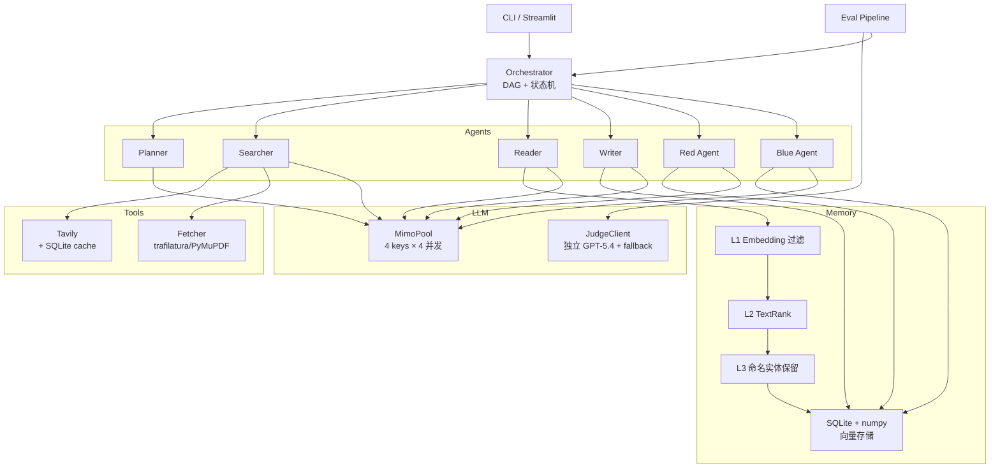
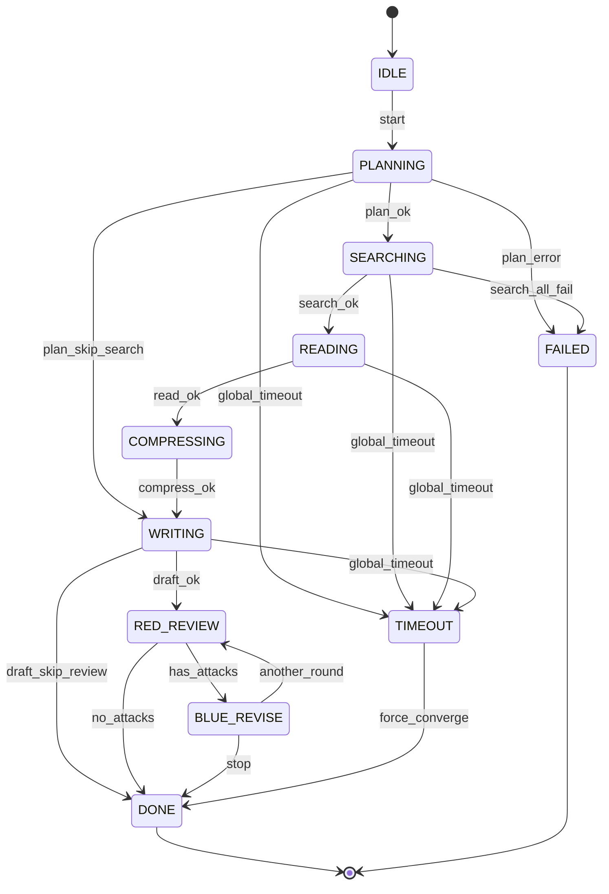
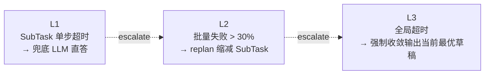

# Architecture

DeepResearch-MultiAgent 由四层组成：CLI/UI 入口 → Orchestrator → Agents → 基础设施（LLM 网关 / Memory / Tools / Eval）。

## 组件总览



## 状态机

完整 9 状态 + 2 异常态。所有合法转移声明在 `orchestrator/state_machine.py` 的 `TRANSITIONS` 表中，可通过 `dr-agent state-graph` 输出 mermaid。



## 三级降级



## MimoPool 调度

每个 mimo API key 拥有：

- 一个 `asyncio.Semaphore(4)`（并发上限，对应"安全并发"配额）
- 一个 `SlidingWindowBucket(rpm=100, window=60s)`（每分钟请求上限）
- 一个 cooldown 时间戳（被 429 后退避到的时间）

每次请求按 **`(in_flight ASC, recent_rpm_usage ASC)`** 排序选 key（least-in-flight）。失败重试逻辑：

1. 同 key 重试 1 次（`max_retries=2`）
2. 切换到另一个可用 key 重试 1 次
3. 全部失败抛 `LLMUnavailable`

429 时，触发 key 的 `cooldown_until = now + retry_after`，期间不参与选 key。

## 三级语义压缩

| 阶段 | 输入 | 操作 | 输出 |
|---|---|---|---|
| L1 | 多个 chunk + SubTask query | bge-small-zh 编码 → cosine 阈值过滤（默认 0.45） | 相关性高的 chunk |
| L2 | 每个 chunk 内的句子 | jieba 分词 + TextRank 图中心度排序，保留 top-k（默认 8） | 关键句集合 |
| L3 | 被 L2 排除的句子 | 正则识别数字 / 年份 / 引号 / 大写缩写 → 强制保留 | 增补的 protected 句子 |

最终输出按 `(is_protected DESC, score DESC)` 排序，可选 token 预算截断。

## Red-Blue 对抗

Red Agent 输出结构化 JSON：

```json
{
  "attacks": [
    {
      "section_id": "sec-3",
      "type": "factual" | "logic" | "citation" | "completeness",
      "span": "<EXACT 子串>",
      "evidence": "<攻击依据>",
      "severity": 0.0..1.0,
      "suggested_action": "ADD" | "DELETE" | "MODIFY" | "VERIFY"
    }
  ]
}
```

Blue Agent 对每条 attack 输出 Patch，应用前经 **citation-preservation invariant** 校验：

- `MODIFY`：若 `target_span` 含 `[n]` 引用而 `new_text` 没有，patch 被拒绝
- `DELETE`：若删除会让 `[n]` 在该 section 中孤立，patch 被拒绝
- `ADD` / `VERIFY`：始终允许

JSON 解析三层 fallback：

1. **direct**：原始响应直接 `json.loads`（含去 markdown fence + 正则提取兜底）
2. **strict-retry**：把上次错误响应放进 history，再发一条系统消息要求"严格 JSON，无 markdown，无解释"，启用 `response_format={"type":"json_object"}`
3. **regex**：从历次 raw 响应中正则抓 `{...}` 块

## 评测体系

```
Bench (35Q × 11 domains)
    │
    ├─ rule_metrics.py
    │     • factual_accuracy:   bge-small cosine ≥ 0.55 → 命中 reference_fact
    │     • hallucination_rate: 句子 cosine ≥ 0.65 → 命中 forbidden_claim 比例
    │     • citation_coverage:  含 [n] 或 [text](url) 的句子比例
    │
    ├─ judge_metrics.py
    │     • 5 维 rubric × n_samples 自一致性（取均值）
    │     • 独立 GPT-5.4 端点；端点不可用时自动降级到 mimo + 标注 self_bias_risk
    │
    └─ stats.py
          • Bootstrap (BCa) 95% CI （n_iters=1000, BCa 偏差/加速校正）
          • Cohen's d 配对效应量
```

## 关键设计权衡

| 选择 | 替代方案 | 决定理由 |
|---|---|---|
| 自研 DAG + 状态机 | LangGraph | 控制力强 / 面试可深讲 / 少一层抽象 |
| SQLite + numpy 暴力 cosine | Milvus / Qdrant | 万级以下记录，外部向量库是过度工程；启动零成本 |
| 独立 Judge 模型族 | mimo 自评 | 自评有显著 self-preference bias（见 Zheng+2023, Panickssery+2024） |
| Tavily 而不是 SerpAPI | SerpAPI / DuckDuckGo | Tavily 直接返回 LLM-ready 清洗后正文；免费额度 1000/月 |
| bge-small-zh-v1.5 (95MB) | bge-m3 / OpenAI embedding | 万级以下足够；离线无 API 依赖；CUDA < 5ms |
| 三层 JSON fallback | strict mode 一次过 | mimo 偶尔违反 JSON；稳健兜底是工程必须 |

## 性能数据

- 单次完整 pipeline（含 K=2 Red-Blue）：60-90 秒（取决于 SubTask 数）
- 35 题 × 3 配置消融（含 Red-Blue）：约 70 分钟
- mimo 4 keys 实测最高 RPM 用量：1-3 / 100（因任务串行性，远未触及 RPM 上限；瓶颈在单调用延迟）
- bge embedding GPU 编码：512-D, < 5ms / sentence
- SQLite + numpy 检索（1.7k entries）：< 50ms
