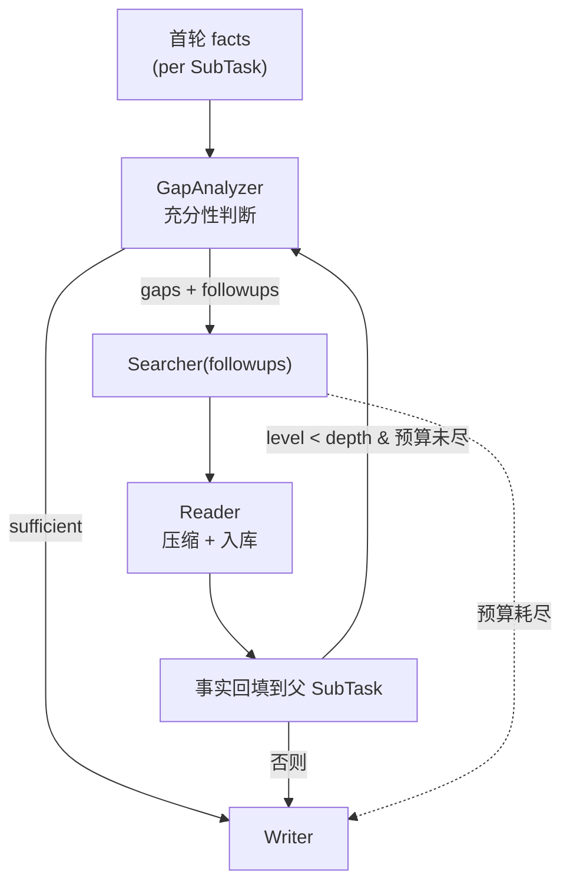

# Recursive Deep-Dive

Turns the single-layer retrieve-read-write pipeline into a **recursive
deep-research** loop, comparable to the breadth/depth knob in GPT-Researcher
and dzhng/deep-research.

## How it works

After the first Searcher+Reader pass produces facts per top-level SubTask,
the deep-dive loop runs for up to `depth` levels:

```
for each level (1..depth):
    GapAnalyzer(subtask, accumulated_facts) ->
        { sufficient, missing_aspects, followups[<=breadth] }
    if sufficient or no followups: stop this branch
    Searcher(followups) -> Reader -> new facts
    append new facts/citations to the parent SubTask
    recurse on followups
```

A **global search budget** (`--deepdive-budget`, default 24) hard-caps the
total number of extra Tavily searches across the whole dive, so a runaway
expansion can never burn the monthly quota. When the budget is exhausted the
dive stops gracefully and the writer proceeds with whatever was gathered.



## Components

| Component | Role |
|---|---|
| `agents/gap_analyzer.py` | LLM judges fact sufficiency, proposes `<=breadth` deeper follow-ups (strict JSON; parse failure → "sufficient" safe default) |
| `orchestrator/deepdive.py` | Drives recursion, folds new facts back into parent SubTasks, enforces the global search budget |

## CLI

```bash
# depth=2 levels, up to 2 follow-ups per SubTask per level, cap 16 searches
dr-agent run "你的研究问题" --depth 2 --breadth 2 --deepdive-budget 16
```

`--depth 0` (default) disables deep-dive (single-layer behavior, unchanged).

## Observations

- A minimal run (`--depth 1 --breadth 1 --deepdive-budget 4 --max-results 3`)
  on *"什么是向量数据库 HNSW 索引"*: Planner produced 6 root SubTasks
  (6 searches), then deep-dive issued 4 follow-ups (budget exhausted at 4/4)
  and folded in **+293 compressed facts** — follow-up queries tend to hit
  richer sources than the broad root queries.
- **Budget sizing**: with N root SubTasks you want a budget of roughly
  `N * breadth` to give every branch a fair chance; too small a budget
  starves later branches (they hit the cap first). The hard cap is a quota
  safety net, not a tuning knob for quality.
- Deep-dive multiplies Tavily usage by up to `1 + depth*breadth` per SubTask,
  so it is **off by default** and gated behind an explicit budget.

## Tests

`tests/test_deepdive.py` covers (offline, fully mocked):
- budget grant/exhaustion arithmetic
- facts folded back into parent SubTasks
- budget cap is never exceeded
- recursion stops when GapAnalyzer says "sufficient"
- recursion reaches the configured depth
